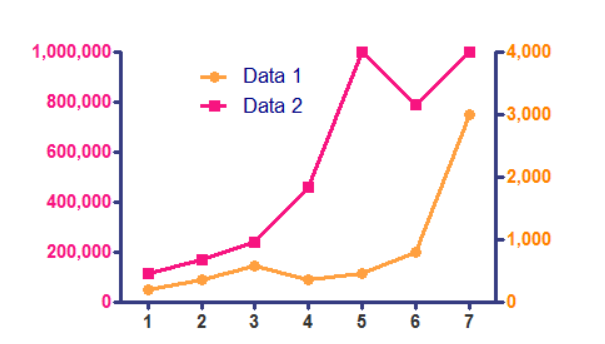

T.C. Çevre Şehircilik ve İklim Değişikliği bakanlığının ülke genelinde yaptığı hava kalitesi
ölçümleri [https://sim.csb.gov.tr/Services/AirQuality](https://sim.csb.gov.tr/Services/AirQuality) adresinde bulunan web uygulamasında istasyon bazında görsellenebilmektedir. 

Ham veriler ise [https://sim.csb.gov.tr/STN/STN_Report/StationDataDownloadNew](https://sim.csb.gov.tr/STN/STN_Report/StationDataDownloadNew) adresinden *Excel* formatında indirlebilmektedir. 

## Egzersiz 1 - Veri ithali

**Doğduğunuz şehre** ait olan **saatlik** hava kalitesi parametrelerini *Excel* formatında **doğduğunuz ay** için indirin. Tam bir aylık veri indirmeniz gerekmektedir.

Örnek :

- Mart ayında doğduysanız Mart 2023 verisi (Çünkü Mart 2024 bitmedi)
- Aralık ayında doğduysanız Aralık 2023 verisi
- Şubat ayında doğduysanız Şubat 2024 verisi

Yaratacağınız data.frame nesnesinin sütun isimleri Excel'de bulunan değişken sütun isimlerini içermelidir. *havaK* nesnesinin ilk 10 satırının raporda gözükmesini sağlayın.

```{r}
# Excel dosyasındaki ham verileri data.frame formatında R'a ithal edin
# havaK <- <kodu tamamla>
install.packages("readxl")
library(readxl)
havaK <- readxl::read_xlsx("C:\\Users\\haruka\\Desktop\\havaInfo.xlsx")
print(havaK)
```

## Egzersiz 2 - Veri Kalite Kontrolü

### Zaman sütunu
Zaman değerlerini içeren sütunun isminin **Time** olmasını sağlayın
```{r}
#  <kodu tamamla>
colnames(havaK)[which(colnames(havaK) == "Tarih")] <- "Time"
```


*havaK$Time* adlı değişkendeki bütün verilerin **POSIXct** tipinde olmasını sağlayın. 

```{r}
# <kodu tamamla>
havaK$Time <- as.POSIXct(havaK$Time)
```

*Time* sütunu dışındaki bütün sütunların tipinin **numeric** olmasını sağlayın. *havaK* nesnesinin ilk 10 satırının raporda gözükmesini sağlayın.

```{r}
# <kodu tamamla>
havaK[-which(names(havaK) == "Time")] <- lapply(havaK[-which(names(havaK) == "Time")], function(x) {  
# Sayısal olmayan karakterleri ve boşlukları temizle    
x <- gsub("[^0-9,]", "", x)  
# Ondalık ayırıcıları noktaya çevir  
#- olanları boş yapalım ki NA çevrilsin    
x <- gsub("-", "", x)  
x <- gsub(",", ".", x)  
# Sayısal değerlere dönüştür  
as.numeric(x)})
head(havaK, 10)
```

## Egzersiz 3 - Veri Görselleme
*dygraphs* paketini kullanarak veri setinizde bulunan iki farklı parametreyi aynı grafik üzerinde iki değişik aks kullanarak (bkz örnek) çizin.




```{r}
install.packages("dygraphs")
library(dygraphs)
#  <kodu tamamla>
data_subset <- havaK[, c("Time", "PM10", "CO")]
dygraph(data_subset) %>%
  dyAxis("y", "PM10", label = "PM10") %>%
  dyAxis("y", "CO", label = "CO", independentTicks = TRUE) %>%
  dySeries("PM10", label = "PM10") %>%
  dySeries("CO", label = "CO") %>%
  dyRangeSelector()  
```
